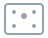

<div align="center">
    <h1>JINRAI</h1>
    
    <p>
    <h3>迅雷</h3>
    <div>思考の速度で素早くウィンドウの切り替えや認識を行うためのhammerspoonスクリプト</div>
    </p>
    <p>
        <a href="https://github.com/tadashi-aikawa/jinrai/actions/workflows/ci.yml">
          
        </a>
        <a href="https://github.com/tadashi-aikawa/jinrai/blob/main/LICENSE">
          
        </a>
    </p>
</div>

---

- 🔠 **Window Hints**
    - アプリアイコン＋キーヒントによるウィンドウ切り替え
        - アプリ名の頭文字をキーヒントのプレフィックスに自動割り当て
        - 同一プレフィックスのウィンドウが複数ある場合は複数キー入力で絞り込み
        - ヒントをクリックして該当ウィンドウをアクティブ化することも可能
    - 他のウィンドウに完全に隠れた(サンプリング近似)ウィンドウは画面下部にドック形式＋プレビュー付きで表示
        - 可能な範囲で前面ウィンドウのヒントと重ならない位置へ調整
    - アクティブウィンドウをオーバーレイでハイライト表示
- 🔳 **Focus Border**
    - フォーカスが移動したウィンドウの枠を一瞬だけハイライト表示
- ↩️ **Focus Back**
    - ホットキーで直前にアクティブだったウィンドウに戻る
- 🪟 **Window Mover**
    - アクティブウィンドウを次のディスプレイへ移動し、移動先で最大化する
    - アクティブウィンドウをアクティブディスプレイ上の最大空き領域へ移動・リサイズする
    - アクティブウィンドウの最小化と最大化をホットキーで実行する
    - 左端・中央・右端へ移動し、実行のたびに横幅を 1/2・1/3・2/3 で切り替える
    - キーヒントで設定済みエリアを選択し、アクティブウィンドウをそこへ移動する

## デモ動画

[](https://youtu.be/clwLqNw0kXw?si=gdetaK7lY0Eovjpp)

[](https://www.youtube.com/watch?v=Dg_fxulwFok)

## Deep Wiki

[](https://deepwiki.com/tadashi-aikawa/jinrai)

## 開発者ブログ記事（日本語）

[📘至高のウィンドウ切り替えを目指して『JINRAI(迅雷)』をつくった - Minerva](https://minerva.mamansoft.net/2026-03-01-jinrai-ultimate-window-switching)

## セットアップ

### 前提準備

まだ Hammerspoon をインストールしていない場合:

```bash
brew install --cask hammerspoon
open -a Hammerspoon
```

続いて SpoonInstall をインストール:

```bash
mkdir -p ~/.hammerspoon/Spoons
curl -L https://github.com/Hammerspoon/Spoons/raw/master/Spoons/SpoonInstall.spoon.zip -o /tmp/SpoonInstall.spoon.zip
unzip -o /tmp/SpoonInstall.spoon.zip -d ~/.hammerspoon/Spoons
```

### SpoonInstall でインストール（推奨）

Hammerspoon Console で以下を1回だけ実行:

```lua
hs.loadSpoon("SpoonInstall")
spoon.SpoonInstall:installSpoonFromZipURL(
  "https://github.com/tadashi-aikawa/jinrai/releases/latest/download/Jinrai.spoon.zip"
)
hs.reload()
```

続いて `~/.hammerspoon/init.lua` に以下を追加:

```lua
hs.loadSpoon("Jinrai")

spoon.Jinrai:setup({
  focus_border = {},
  window_hints = {},
  focus_back = {},
  window_mover = {
    commands = {
      moveToNextDisplay = {
        hotkey = {
          modifiers = { "ctrl", "alt" },
          key = "m",
        },
      },
    },
  },
})
```

> [!WARNING]
> 初回インストールコマンドを `~/.hammerspoon/init.lua` に置くと、`hs.reload()` によって再読込のたびに再実行されてループします。インストール時だけHammerspoon Consoleから実行してください。

`focus_border` や `window_hints`、`focus_back`、`window_mover` のキーを省略するとそのモジュールは無効になります。

### アップデート

Jinraiを読み込むと、macOSのメニューバーにモノクロの稲妻アイコンが追加されます。クリックすると、現在のバージョンを確認できます。

`Check for Updates...` を選ぶとGitHub Releasesの最新版を確認します。更新がある場合は、メニューの `Update to vX.Y.Z...` または表示された通知をクリックすると、SpoonInstallで更新してHammerspoonを再読み込みします。

ソースからインストールした開発版は自動更新の対象外です。開発版の更新には `git pull` を使用してください。

### ソースからインストール（開発向け）

Git + symlink でインストールします:

```bash
git clone https://github.com/tadashi-aikawa/jinrai /path/to/jinrai
ln -sfn /path/to/jinrai/Jinrai.spoon ~/.hammerspoon/Spoons/Jinrai.spoon
```

`~/.hammerspoon/init.lua` に以下を追加:

```lua
hs.loadSpoon("Jinrai")

spoon.Jinrai:setup({
  focus_border = {},
  window_hints = {},
  focus_back = {},
  window_mover = {
    commands = {
      moveToNextDisplay = {
        hotkey = {
          modifiers = { "ctrl", "alt" },
          key = "m",
        },
      },
    },
  },
})
```

`focus_border` や `window_hints`、`focus_back`、`window_mover` のキーを省略するとそのモジュールは無効になります。

更新する場合:

```bash
git -C /path/to/jinrai pull
```

## 設定例

```lua
hs.loadSpoon("Jinrai")

spoon.Jinrai:setup({
  macosNativeTabs = {
    -- 詳細は後続の「macOS Native Tabs オプション」の全設定例を参照
  },
  focus_border = {
    -- 詳細は後続の「Focus Border オプション」の全設定例を参照
  },
  jinrai_mode = {
    -- 詳細は後続の「JinraiMode オプション」の全設定例を参照
  },
  window_hints = {
    -- 詳細は後続の「Window Hints オプション」の全設定例を参照
  },
  focus_back = {
    -- 詳細は後続の「Focus Back オプション」の全設定例を参照
  },
  window_mover = {
    -- 詳細は後続の「Window Mover オプション」の全設定例を参照
  },
})
```

## JinraiMode オプション

JinraiMode は Window Hints と Window Mover を連続実行するモードです。Window Hints のヒント表示中、または Window Mover の `moveToSelectedArea` chooser 表示中から開始できます。

```lua
jinrai_mode = {
  triggers = {
    windowHints = {
      key = nil, -- Window Hints 表示中に JinraiMode を開始するキー
    },
    windowMover = {
      key = nil, -- moveToSelectedArea chooser 表示中に JinraiMode を開始するキー
    },
  },
  logo = {
    enabled = true, -- JinraiMode 中に Jinrai ロゴを表示するか
    size = 480,     -- ロゴサイズ (px)
    alpha = 0.4,    -- ロゴの透明度
  },
  combo = {
    character = {
      enabled = false, -- キャラクター画像を表示するか
      alpha = 0.5,     -- キャラクター画像の透明度
    },
    text = {
      enabled = false, -- COMBO 文字を表示するか
      alpha = 0.7,     -- COMBO 文字と黒縁の透明度
    },
  },
}
```

Window Hints では `triggers.windowHints.key` を押すと JinraiMode に入り、ウィンドウ選択後に Window Mover の `moveToSelectedArea` chooser が開きます。Window Mover では `moveToSelectedArea` chooser を開いた後に `triggers.windowMover.key` を押すと JinraiMode に入り、エリアまたは action 適用後に Window Hints が開きます。どちらかでキャンセルすると JinraiMode は終了します。
`window_mover.selectedArea.windowHints.key` を設定すると、アクティブウィンドウを選び直したいときに `moveToSelectedArea` chooser から Window Hints へ即時に戻れます。JinraiMode の連鎖中は Window Hints を JinraiMode として開き直し、連鎖を継続します。
JinraiMode 中は Window Hints と Window Mover の間を遷移するたびにコンボ数が増えます。`combo.character.enabled` を有効にすると中央にキャラクター画像を表示し、`combo.text.enabled` を有効にすると Jinrai ロゴの12px上に黒縁付きのコンボ数を表示します。画像は4枚を順番に繰り返します。Window Hints と Window Mover の `selectedArea` ヒントはロゴやキャラクターより常に前面に表示されます。通常モードの遷移ではコンボは加算・表示されません。
`triggers.windowMover.key` は設定済みの selected-area/action キーと衝突してはいけません。`key = "k"` とエリアキー `"KD"` のような prefix 衝突もエラーになります。

## macOS Native Tabs オプション

`macosNativeTabs` は、macOSネイティブタブを使うアプリ向けの補正設定です。

対象アプリではタブごとに異なるウィンドウIDが割り当てられるため、Window HintsではSpaceを解決できないタブ状候補を非表示にし、Focus Backでは同一アプリ内のタブ移動を履歴更新対象から外します。

```lua
macosNativeTabs = {
  apps = { "com.example.terminal" }, -- 追加アプリ名またはbundle IDの配列
  stateSyncInterval = 0.5,           -- Focus Back用の状態同期間隔（秒、未指定時は0.5）
}
```

`apps` に指定したアプリは組み込みのデフォルト設定へ追加されます。補正を完全に無効化する場合は `macosNativeTabs = false` を指定します。

デフォルト設定:

- `com.mitchellh.ghostty`
- `com.apple.finder`

## Focus Border オプション

全設定を含むサンプル（デフォルト値）:

```lua
focus_border = {
  visual = {
    border = {
      width = 10, -- メインボーダーの太さ (px)
      color = { red = 0.40, green = 0.68, blue = 0.98, alpha = 0.95 }, -- メインボーダーの色
    },
    outline = {
      width = 2, -- 外側アウトラインの太さ (px)
      color = { red = 0, green = 0, blue = 0, alpha = 0.70 }, -- 外側アウトラインの色
    },
    logo = nil, -- ウィンドウ中央に表示するロゴ。nil/false の場合は非表示
    -- logo = {
    --   source = nil, -- 画像パスまたはURL。nil の場合はJINRAI同梱ロゴ
    --   size = 480, -- 画像の表示大きさ (px)
    --   alpha = 0.95, -- 画像の透明度
    -- },
  },
  animation = {
    duration = 0.5, -- フェードアウト時間 (秒)
    fadeSteps = 18, -- フェードアウトのステップ数
    spaceSwitchDelay = 0.30, -- 別 Space へ移動したときだけ追加で待つ時間 (秒)
  },
  window = {
    minSize = 480, -- 表示する最小ウィンドウサイズ (px)
  },
}
```

`spaceSwitchDelay` は、直前にフォーカスしていたウィンドウと別の macOS Space にあるウィンドウがアクティブになったときだけ適用されます。同じ Space 内のフォーカス移動では従来通り即時表示です。

`visual.logo` を指定すると、アクティブになったウィンドウの中央に画像を表示します。`source` にはローカル画像パスまたはURLを指定できます。未指定または `false` の場合は表示しません。

## Window Hints オプション

注: このスキーマは破壊的変更です。`hint.keyBox`、`hint.text`、`hint.badge`、`hint.offSpaceBadge`、`hint.overlay`、`hint.onActiveWindow`、`activeWindow`、`navigation.focusBackKey`、`navigation.directionKeys`、`navigation.directHotkeys`、`navigation.spaceKeys`、`behavior.centerCursor` などの旧キーは使えません。

全設定を含むサンプル（デフォルト値）:

```lua
window_hints = {
  hotkey = {
    modifiers = { "alt" }, -- ヒント表示ホットキー修飾キー
    key = "f20",            -- ヒント表示ホットキー
  },
  hint = {
    chars = { "A", "S", "D", "F", "G", "H", "J", "K", "L", "Q", "W", "E", "R", "T", "Y", "U", "I", "O", "P", "Z", "X", "C", "V", "B", "N", "M" }, -- ヒント文字配列
    prefixOverrides = nil, -- prefix 上書きルール配列
    padding = 12, -- ヒント本体の内側余白 (px)
    collisionOffset = 90, -- ヒント重なり時のずらし量 (px)
    cornerRadius = 12, -- ヒント本体の角丸半径 (px)
    occludedScale = 0.85, -- 遮蔽ヒント縮小率
    highlight = {
      borderWidth = 6, -- ヒント本体ハイライトのボーダー幅 (px)
    },
    state = {
      normal = {
        bgColor = { red = 0.03, green = 0.03, blue = 0.04, alpha = 0.80 }, -- ヒント本体背景色
        highlight = {
          fillColor = { red = 0.40, green = 0.68, blue = 0.98, alpha = 0.56 }, -- 通常ヒントの塗り色
          borderColor = { red = 0.40, green = 0.68, blue = 0.98, alpha = 0.85 }, -- 通常ヒントのボーダー色
        },
      },
      dimmed = {
        bgColor = { red = 0.03, green = 0.03, blue = 0.04, alpha = 0.14 }, -- dimmed 時ヒント本体背景色
        highlight = {
          borderColor = { red = 0.45, green = 0.45, blue = 0.48, alpha = 0.30 }, -- dimmed 時ヒント本体ボーダー色
        },
      },
      occluded = {
        bgColor = { red = 0.03, green = 0.03, blue = 0.04, alpha = 0.70 }, -- 遮蔽ヒント本体背景色
      },
      active = {
        bgColor = { red = 0.08, green = 0.05, blue = 0.03, alpha = 0.88 }, -- アクティブウィンドウ上ヒントの背景色
        highlight = {
          fillColor = { red = 0.95, green = 0.68, blue = 0.40, alpha = 0.56 }, -- アクティブウィンドウ上ヒントの塗り色
          borderColor = { red = 0.95, green = 0.68, blue = 0.40, alpha = 0.95 }, -- アクティブウィンドウ上ヒントのボーダー色
        },
      },
    },
    icon = {
      size = 72, -- アイコンサイズ (px)
      state = {
        normal = { alpha = 0.95 }, -- アイコン不透明度
        dimmed = { alpha = 0.30 }, -- dimmed 時アイコン不透明度
        occluded = { alpha = 0.46 }, -- 遮蔽ヒントアイコン不透明度
        active = { alpha = 1.0 }, -- アクティブウィンドウ上ヒントのアイコン不透明度
      },
    },
    key = {
      size = 72, -- キー表示ボックス高さ (px)
      minWidth = 72, -- キー表示ボックス最小幅 (px)
      horizontalPadding = 10, -- キー表示ボックス左右パディング (px)
      gap = 0, -- アイコンとキー表示ボックスの間隔 (px)
      fontName = nil, -- キー文字フォント名（nil でシステムデフォルト）
      fontSize = 48, -- キー文字フォントサイズ
      keyHighlightColor = { red = 0.84, green = 0.84, blue = 0.86, alpha = 0.35 }, -- 入力済みプレフィックス色
      state = {
        normal = {
          color = { red = 1, green = 1, blue = 1, alpha = 1 }, -- キー文字色
        },
        dimmed = {
          color = { red = 0.85, green = 0.85, blue = 0.88, alpha = 0.28 }, -- dimmed 時キー文字色
        },
        occluded = {},
        active = {
          color = { red = 1.00, green = 0.93, blue = 0.86, alpha = 1.00 }, -- アクティブウィンドウ上ヒントのキー文字色
        },
      },
    },
    title = {
      fontName = nil, -- タイトル文字フォント名（nil の場合は key.fontName にフォールバック）
      fontSize = 16, -- タイトル文字フォントサイズ
      rowGap = 8, -- アイコン行とタイトル行の間隔 (px)
      maxSize = 72, -- タイトル最大表示文字数
      show = true, -- タイトル行表示
      state = {
        normal = {
          color = { red = 0.90, green = 0.92, blue = 0.96, alpha = 1.00 }, -- タイトル文字色
        },
        dimmed = {
          color = { red = 0.90, green = 0.92, blue = 0.96, alpha = 0.30 }, -- dimmed 時タイトル文字色
        },
        occluded = {},
        active = {
          color = { red = 0.99, green = 0.90, blue = 0.78, alpha = 1.00 }, -- アクティブウィンドウ上ヒントのタイトル文字色
        },
      },
    },
    spaceBadge = {
      enabled = true, -- 別 Space 候補に Space バッジを表示するか
      size = 32, -- 右上バッジ直径 (px)
      state = {
        normal = {
          fillColor = { red = 0.34, green = 0.64, blue = 0.96, alpha = 0.56 }, -- Space バッジ塗り色（デフォルト/フォールバック）
          strokeColor = { red = 0.98, green = 0.99, blue = 1.00, alpha = 0.72 }, -- Space バッジ枠線色（デフォルト/フォールバック）
          textColor = { red = 1.0, green = 1.0, blue = 1.0, alpha = 0.92 }, -- Space バッジ文字色（デフォルト/フォールバック）
        },
        dimmed = {
          fillColor = { red = 0.34, green = 0.64, blue = 0.96, alpha = 0.28 }, -- dimmed 時の塗り色
          strokeColor = { red = 0.98, green = 0.99, blue = 1.00, alpha = 0.40 }, -- dimmed 時の枠線色
          textColor = { red = 1.0, green = 1.0, blue = 1.0, alpha = 0.35 }, -- dimmed 時の文字色
        },
        occluded = {},
        active = {
          fillColor = { red = 0.95, green = 0.68, blue = 0.40, alpha = 0.56 }, -- アクティブウィンドウ上ヒントの Space バッジ塗り色
          strokeColor = { red = 1.00, green = 0.90, blue = 0.78, alpha = 0.72 }, -- アクティブウィンドウ上ヒントの Space バッジ枠線色
          textColor = { red = 1.0, green = 0.98, blue = 0.94, alpha = 0.92 }, -- アクティブウィンドウ上ヒントの Space バッジ文字色
        },
      },
      spaceColors = { -- Space 番号ごとの色上書き（番号をインデックスに使用）。省略したフィールドは state.normal にフォールバック
        { fillColor = { ... }, strokeColor = { ... }, textColor = { ... } }, -- Space 1
        { fillColor = { ... }, strokeColor = { ... }, textColor = { ... } }, -- Space 2
        -- ...
      },
    },
  },
  focusedWindowHighlight = {
    borderColor = { red = 0.95, green = 0.68, blue = 0.40, alpha = 0.95 }, -- フォーカス中ウィンドウのボーダー色
    borderWidth = 13, -- フォーカス中ウィンドウのボーダー幅 (px)
  },
  occlusion = {
    sampling = {
      enabled = true,   -- 遮蔽サンプリングを動的化するか
      baseWidth = 1920, -- サンプリング基準ウィンドウ幅 (px)
      baseHeight = 1080, -- サンプリング基準ウィンドウ高さ (px)
      minCols = 4,      -- サンプリング列数の最小値
      minRows = 4,      -- サンプリング行数の最小値
      maxCols = 8,      -- サンプリング列数の最大値
      maxRows = 8,      -- サンプリング行数の最大値
    },
    preview = {
      enabled = true,        -- 遮蔽ウィンドウのプレビューを表示するか
      mode = "background",   -- プレビュー表示モード ("background": ヒント背景に全面表示 / "below": タイトル下に表示)
      width = 140,           -- プレビュー幅 (px)。backgroundモードでは画面高さいっぱいのウィンドウの縮小後の高さ
      padding = 6,           -- プレビュー上余白 (px, belowモードのみ)
      alpha = 0.64,          -- プレビュー不透明度
    },
  },
  dock = {
    bottomMargin = 96, -- 遮蔽ヒントドックの下端マージン (px)
    itemGap = 12,      -- ドック内アイテム間隔 (px)
    windowBlend = {
      x = 0.65, -- ドックXを対象ウィンドウへ寄せる割合
      y = 1, -- ドックYを対象ウィンドウへ寄せる割合
    },
  },
  navigation = {
    focusBack = {
      key = nil, -- Hints表示中に Focus Back 相当を実行するキー
    },
    direction = {
      hints = {
        keys = nil, -- Hints表示中の方向移動キー
      },
      direct = {
        modifiers = nil, -- Hintsを表示せず方向移動するホットキー修飾キー
        keys = nil, -- Hintsを表示せず方向移動するホットキー
      },
      scoring = {
        cardinalOverlapTieThresholdPx = 720, -- 上下左右方向移動で同点扱いにする閾値 (px)
        maxPrimaryOverlapRatioForDetached = 0.2, -- 主軸の重なり率がこの値以下なら離れた候補として扱う
        minOrthogonalOverlapRatio = 0.5, -- 離れた候補ではない場合に必要な副軸重なり率
        preferredVisibleRatio = 0.4, -- サンプリング上の可視率がこの値以上の候補を優先
        debug = false, -- 方向移動の候補スコアログを出すか
      },
    },
    spaces = {
      numbers = true, -- ヒント表示中に 1-9 キーで Space を切り替え
      prev = {
        key = nil, -- ヒント表示中に前の Space へ移動するキー
      },
      next = {
        key = nil, -- ヒント表示中に次の Space へ移動するキー
      },
    },
    windowMover = {
      moveToSelectedArea = {
        key = nil, -- ヒントを閉じて moveToSelectedArea chooser を開くキー
      },
    },
  },
  behavior = {
    selection = {
      swapWindowFrame = {
        modifiers = nil, -- 確定時にウィンドウフレーム入れ替えする修飾キー
      },
    },
    cursor = {
      onSelect = true, -- 選択後にカーソルをウィンドウ中央へ移動
      onStart = true, -- 起動時にアクティブウィンドウ中央へカーソル移動
    },
    candidates = {
      includeOtherSpaces = true, -- 他の Space の可視ウィンドウも候補に含める
      includeActiveWindow = true, -- アクティブウィンドウにもヒントを表示する
    },
    callbacks = {
      onSelect = nil, -- ウィンドウ選択時コールバック
      onError = nil,  -- エラー時コールバック
    },
  },
}
```

遮蔽判定は対象ウィンドウ内のサンプル点で行う近似判定です。
`occlusion.sampling.enabled=true` の場合、`occlusion.sampling.baseWidth/baseHeight` を基準に
`occlusion.sampling.min*` から `occlusion.sampling.max*` の範囲でサンプリンググリッドを動的に調整します。

### hint.prefixOverrides

`hint.prefixOverrides` は、ウィンドウごとのヒントキー先頭文字（prefix）を上書きするための設定です。
ルールは上から順に評価され、最初に一致したルールが適用されます。

#### hint.prefixOverrides の定義

```lua
hint = {
  prefixOverrides = {
    {
      match = {
        bundleID = "md.obsidian",   -- 任意
        titleGlob = "Minerva*",     -- 任意 (`window:title()` 対象、`*` と `?` をサポート)
      },
      prefix = "M",                 -- 1文字または2文字。各文字は hint.chars に含まれている必要あり
    },
  },
}
```

#### hint.prefixOverrides の動作

- `match.bundleID` と `match.titleGlob` はどちらか必須
- `titleGlob` は大文字小文字を区別
- 表示キー集合は prefix-free になるよう自動調整（例: `G` と `GC` が競合した場合は `GA` と `GC`）
- どのルールにも一致しない場合は、アプリ名の文字を先頭から見て `hint.chars` に含まれる文字を選ぶ（同じ文字が使用済みなら次候補へ）。候補がなければ `hint.chars[1]` にフォールバック
- `prefix` が不正（`hint.chars` 外の文字、3文字以上など）の場合はエラー

実装上のデフォルト値や内部向け設定は、`window_hints_config.lua` 内の `DEFAULT_CONFIG` を参照してください。

### Window Hints 内ナビゲーション

- ヒント表示中に Window Hints のホットキーをもう一度押すと、ヒントを閉じます
- `navigation.focusBack.key` と `navigation.direction.hints.keys` はヒント表示中のみ有効です
- `navigation.focusBack.key` は `focus_back` 設定が有効なときだけ動作します
- `navigation.windowMover.moveToSelectedArea.key` は Window Hints を閉じ、アクティブウィンドウに対して Window Mover の `moveToSelectedArea` chooser を開きます。ウィンドウ選択後に chooser を開く JinraiMode とは別機能です
- これらのキーと `hint.chars` が競合する場合、競合文字はヒント側から除外され、ナビゲーションキーが優先されます
- ヒントをクリックすると、そのヒントキーを入力した場合と同じウィンドウを選択します
- ヒント表示中にすべてのヒントの外側をクリックすると、ヒントを閉じます
- 完全に背面に遮蔽されているウィンドウは方向移動の候補から除外されます
- 上下左右では、候補ウィンドウの方向側エッジが現在ウィンドウの方向側エッジを越えている必要があります。現在ウィンドウより短く、中心が少しだけ右/左/上/下にズレているだけのウィンドウは方向候補にしません
- 上下左右では、主軸の重なり率が `navigation.direction.scoring.maxPrimaryOverlapRatioForDetached` 以下なら移動方向に離れた候補として扱い、副軸重なり率では除外しません。主軸の重なり率がそれを超える候補は、副軸重なり率が `navigation.direction.scoring.minOrthogonalOverlapRatio` 以上の場合だけ候補にします
- 上下左右は基本的に「副軸の重なり量が大きい」候補を優先し、重なり差が `navigation.direction.scoring.cardinalOverlapTieThresholdPx` 以内なら同点扱いとして次に主軸エッジ距離、前面順、副軸ずれ、直前アクティブウィンドウの順で決定します
- `navigation.direction.scoring.preferredVisibleRatio` は、上下左右でサンプリング上の可視率がその値以上の候補を、大きく隠れた候補より優先します。方向候補がすべてしきい値未満の場合は、しきい値未満の候補も選択対象に残し、その中では可視率が高い候補を先に見ます。`0` にするとこの優先を無効化できます
- 斜め方向は2軸のエッジ距離合計が小さい候補を優先し、同率時は前面順、中心距離、直前アクティブウィンドウの順で決定します

### 直接方向移動ホットキー

`navigation.direction.direct` は、Window Hints を出さずに方向移動を直接実行する設定です。

```lua
navigation = {
  direction = {
    direct = {
      modifiers = { "ctrl", "alt" }, -- 必須
      keys = {                       -- 任意。指定した方向だけ有効
        left = "h",
        down = "j",
        up = "k",
        right = "l",
        upLeft = "y",
        upRight = "u",
        downLeft = "b",
        downRight = "n",
      },
    },
  },
}
```

- 移動先の判定は `navigation.direction.hints.keys` と同じ（遮蔽除外・同点時の優先順位を含む）
- キー押下で即フォーカス移動し、Window Hints UI は表示しない
- `keys` を省略した場合は直接方向移動ホットキーを無効化
- `modifiers` では `alt` の別名として `option` も指定可能

### navigation.spaces.numbers

`navigation.spaces.numbers = true`（デフォルト）にすると、ヒント表示中に `1`〜`9` キーで `hs.spaces.gotoSpace()` を使って対応する Space に切り替えます。存在しない番号を押した場合はキーが消費されるだけで何も起こりません。`false` で無効化できます。

### navigation.spaces.prev.key / navigation.spaces.next.key

`navigation.spaces.prev.key` と `navigation.spaces.next.key` は、ヒント表示中に前後の Space へ移動するためのキーです。1文字のキー（例: `","` / `"."`）を指定すると、ヒントを閉じてから Space を切り替えます。デフォルトは `nil`（無効）です。

### behavior.candidates.includeOtherSpaces

`behavior.candidates.includeOtherSpaces = true` にすると、現在の Space だけでなく他の Space にある可視ウィンドウも
Window Hints の候補表示に含めます。デフォルトは `true` です。

- 別 Space の候補は前面オーバーレイではなく、遮蔽ヒントと同じドック系レーンに表示されます
- 右上の丸バッジに Space 番号が表示され、番号ごとに異なる色で識別できます
- バッジの色は `hint.spaceBadge.spaceColors` で Space 番号ごとに設定可能（プリセット5色付き。範囲外の番号はデフォルト色にフォールバック）
- `hint.spaceBadge.enabled = false` でバッジ自体を非表示にできます
- バッジの色やサイズは `hint.spaceBadge` で変更できます
- 選択するとそのまま対象ウィンドウへ `focus()` し、Space 切り替えは macOS 側の挙動に従います
- Hints 中の方向移動と `navigation.direction.direct` は常に current Space の候補だけを対象にします

### behavior.candidates.includeActiveWindow

`behavior.candidates.includeActiveWindow = true` にすると、現在フォーカスしているアクティブウィンドウにもヒントを表示します。デフォルトは `true` です。

- 同一アプリの複数ウィンドウがある場合、アクティブウィンドウも含めてヒントキーが割り当てられるため、キーの一貫性が向上します
- アクティブウィンドウを選択すると、`behavior.cursor.onSelect` が有効であればカーソルをウィンドウ中央に移動します
- アクティブウィンドウの枠線（アクティブオーバーレイ）は引き続き表示されるため、どのウィンドウが現在フォーカスされているか視覚的に判別できます
- `hint.state.active`、`hint.icon.state.active`、`hint.key.state.active`、`hint.title.state.active`、`hint.spaceBadge.state.active` で、アクティブウィンドウ上ヒントの見た目全体を上書きできます
- それぞれの `active` で省略したフィールドは対応する `normal` にフォールバックします

## Focus Back オプション

全設定を含むサンプル（デフォルト値）:

```lua
focus_back = {
  hotkey = {
    modifiers = { "option" }, -- ホットキー修飾キー
    key = "w",                -- ホットキー（nil で無効化）
  },
  urlEvent = {
    name = nil, -- URL scheme名（hammerspoon://<名前> で発火）
  },
  behavior = {
    cursor = {
      onSelect = true, -- 切り替え後にカーソルをウィンドウ中央に移動
    },
  },
  internal = {
    focusHistory = nil, -- 内部注入専用（通常は設定しない）
  },
}
```

連続で押すと2つのウィンドウ間をトグルで行き来できます。

## Window Mover オプション

アクティブウィンドウを次のディスプレイ、アクティブディスプレイ上の最大空き領域、または候補から選んだ任意のディスプレイ領域へ移動・リサイズします。

全設定を含むサンプル（デフォルト値）:

```lua
window_mover = {
  commands = {
    -- 別ディスプレイや算出・設定済み領域へ移動
    moveToNextDisplay = {
      hotkey = {
        modifiers = nil, -- ホットキー修飾キー（nil で無効化）
        key = nil,       -- ホットキー（nil で無効化）
      },
    },
    moveToActiveDisplayFreeArea = {
      hotkey = {
        modifiers = nil, -- ホットキー修飾キー（nil で無効化）
        key = nil,       -- ホットキー（nil で無効化）
      },
    },
    moveToSelectedArea = {
      hotkey = {
        modifiers = nil, -- ホットキー修飾キー（nil で無効化）
        key = nil,       -- ホットキー（nil で無効化）
      },
    },
    moveToSelectedAreaInJinraiMode = {
      hotkey = {
        modifiers = nil, -- ホットキー修飾キー（nil で無効化）
        key = nil,       -- ホットキー（nil で無効化）
      },
    },
    -- アクティブウィンドウの状態やサイズを変更
    maximizeWindow = {
      hotkey = {
        modifiers = nil, -- ホットキー修飾キー（nil で無効化）
        key = nil,       -- ホットキー（nil で無効化）
      },
    },
    minimizeWindow = {
      hotkey = {
        modifiers = nil, -- ホットキー修飾キー（nil で無効化）
        key = nil,       -- ホットキー（nil で無効化）
      },
    },
    -- 横方向の配置と幅を切り替え
    cycleLeft = {
      hotkey = {
        modifiers = nil, -- ホットキー修飾キー（nil で無効化）
        key = nil,       -- ホットキー（nil で無効化）
      },
    },
    cycleHorizontalCenter = {
      hotkey = {
        modifiers = nil, -- ホットキー修飾キー（nil で無効化）
        key = nil,       -- ホットキー（nil で無効化）
      },
    },
    cycleRight = {
      hotkey = {
        modifiers = nil, -- ホットキー修飾キー（nil で無効化）
        key = nil,       -- ホットキー（nil で無効化）
      },
    },
    -- 縦方向の配置と高さを切り替え
    cycleTop = {
      hotkey = {
        modifiers = nil, -- ホットキー修飾キー（nil で無効化）
        key = nil,       -- ホットキー（nil で無効化）
      },
    },
    cycleVerticalCenter = {
      hotkey = {
        modifiers = nil, -- ホットキー修飾キー（nil で無効化）
        key = nil,       -- ホットキー（nil で無効化）
      },
    },
    cycleBottom = {
      hotkey = {
        modifiers = nil, -- ホットキー修飾キー（nil で無効化）
        key = nil,       -- ホットキー（nil で無効化）
      },
    },
    -- 指定サイズでアクティブディスプレイ上の位置へ直接移動
    halfLeft = { hotkey = { modifiers = nil, key = nil } },
    halfHorizontalCenter = { hotkey = { modifiers = nil, key = nil } },
    halfRight = { hotkey = { modifiers = nil, key = nil } },
    halfTop = { hotkey = { modifiers = nil, key = nil } },
    halfVerticalCenter = { hotkey = { modifiers = nil, key = nil } },
    halfBottom = { hotkey = { modifiers = nil, key = nil } },
    thirdLeft = { hotkey = { modifiers = nil, key = nil } },
    thirdHorizontalCenter = { hotkey = { modifiers = nil, key = nil } },
    thirdRight = { hotkey = { modifiers = nil, key = nil } },
    thirdTop = { hotkey = { modifiers = nil, key = nil } },
    thirdVerticalCenter = { hotkey = { modifiers = nil, key = nil } },
    thirdBottom = { hotkey = { modifiers = nil, key = nil } },
    quarterLeft = { hotkey = { modifiers = nil, key = nil } },
    quarterHorizontalLeftCenter = { hotkey = { modifiers = nil, key = nil } },
    quarterHorizontalRightCenter = { hotkey = { modifiers = nil, key = nil } },
    quarterRight = { hotkey = { modifiers = nil, key = nil } },
    quarterTop = { hotkey = { modifiers = nil, key = nil } },
    quarterVerticalTopCenter = { hotkey = { modifiers = nil, key = nil } },
    quarterVerticalBottomCenter = { hotkey = { modifiers = nil, key = nil } },
    quarterBottom = { hotkey = { modifiers = nil, key = nil } },
    quarterTopLeft = { hotkey = { modifiers = nil, key = nil } },
    quarterTopRight = { hotkey = { modifiers = nil, key = nil } },
    quarterBottomLeft = { hotkey = { modifiers = nil, key = nil } },
    quarterBottomRight = { hotkey = { modifiers = nil, key = nil } },
    sixthTopLeft = { hotkey = { modifiers = nil, key = nil } },
    sixthTopCenter = { hotkey = { modifiers = nil, key = nil } },
    sixthTopRight = { hotkey = { modifiers = nil, key = nil } },
    sixthBottomLeft = { hotkey = { modifiers = nil, key = nil } },
    sixthBottomCenter = { hotkey = { modifiers = nil, key = nil } },
    sixthBottomRight = { hotkey = { modifiers = nil, key = nil } },
    twoThirdsLeft = { hotkey = { modifiers = nil, key = nil } },
    twoThirdsHorizontalCenter = { hotkey = { modifiers = nil, key = nil } },
    twoThirdsRight = { hotkey = { modifiers = nil, key = nil } },
    twoThirdsTop = { hotkey = { modifiers = nil, key = nil } },
    twoThirdsVerticalCenter = { hotkey = { modifiers = nil, key = nil } },
    twoThirdsBottom = { hotkey = { modifiers = nil, key = nil } },
  },
  behavior = {
    cursor = {
      afterMove = true, -- 移動後にカーソルをウィンドウ中央に移動
    },
    cycle = {
      horizontalRatios = { 1 / 2, 1 / 3, 2 / 3 }, -- 横方向 cycle コマンドの横幅比率ローテーション
      verticalRatios = { 1 / 2, 1 / 3, 2 / 3 },   -- 縦方向 cycle コマンドの高さ比率ローテーション
    },
  },
  selectedArea = {
    defaultScreen = nil, -- 未設定ディスプレイに流用するキーマップの UUID
    screens = {},        -- ディスプレイ UUID ごとのエリアキーマップ（freeArea を含む）
    actions = {
      closeWindow = nil, -- ウィンドウを閉じる action キー（nil で無効化）
    },
    windowHints = {
      key = nil, -- Window Hints の JinraiMode 表示へ戻るキー（nil で無効化）
    },
    hints = {
      show = true, -- 候補ヒントを canvas で描画する。false でキー入力のみ
    },
    appearance = {
      borderWidth = 2, -- ヒント枠線の太さ (px)
      cornerRadius = 6, -- ヒント角丸の半径 (px)
      state = {
        normal = {
          bgColor = { red = 0.03, green = 0.03, blue = 0.04, alpha = 0.88 },
          textColor = { red = 0.96, green = 1.0, blue = 0.98, alpha = 1.0 },
          typedTextColor = { red = 0.96, green = 1.0, blue = 0.98, alpha = 0.38 },
        },
        dimmed = {
          bgColor = { red = 0.03, green = 0.03, blue = 0.04, alpha = 0.30 },
          textColor = { red = 0.96, green = 1.0, blue = 0.98, alpha = 0.32 },
        },
      },
      styles = {
        full = {
          color = { red = 0.36, green = 0.62, blue = 1.00, alpha = 0.92 },
          dimmedColor = { red = 0.36, green = 0.62, blue = 1.00, alpha = 0.22 },
        },
        twoThirds = {
          color = { red = 0.50, green = 0.82, blue = 0.42, alpha = 0.92 },
          dimmedColor = { red = 0.50, green = 0.82, blue = 0.42, alpha = 0.22 },
        },
        half = {
          color = { red = 0.62, green = 0.52, blue = 1.00, alpha = 0.92 },
          dimmedColor = { red = 0.62, green = 0.52, blue = 1.00, alpha = 0.22 },
        },
        third = {
          color = { red = 0.96, green = 0.66, blue = 0.28, alpha = 0.92 },
          dimmedColor = { red = 0.96, green = 0.66, blue = 0.28, alpha = 0.22 },
        },
        quarter = {
          color = { red = 0.92, green = 0.42, blue = 0.74, alpha = 0.92 },
          dimmedColor = { red = 0.92, green = 0.42, blue = 0.74, alpha = 0.22 },
        },
        sixth = {
          color = { red = 0.75, green = 0.15, blue = 0.25, alpha = 0.92 },
          dimmedColor = { red = 0.75, green = 0.15, blue = 0.25, alpha = 0.22 },
        },
        free = {
          color = { red = 0.58, green = 0.64, blue = 0.70, alpha = 0.95 },
          dimmedColor = { red = 0.58, green = 0.64, blue = 0.70, alpha = 0.22 },
        },
      },
    },
  },
}
```

| コマンド | 説明 |
| --- | --- |
| `moveToNextDisplay` | アクティブウィンドウを現在のディスプレイの `screen:next()` へ移動し、移動先で最大化します。 |
| `moveToActiveDisplayFreeArea` | 現在ディスプレイの `frame()` 内で、前面にある標準ウィンドウと重ならない最大の矩形へ移動します。アクティブウィンドウと、前面ウィンドウに重なる背面ウィンドウは計算から除外します。同面積の場合はアクティブウィンドウに近い領域を優先します。 |
| `moveToSelectedArea` | ディスプレイ UUID ごとに設定した領域、または `selectedArea.actions` の window action を選ぶ chooser を開きます。 |
| `moveToSelectedAreaInJinraiMode` | 最初から JinraiMode として `moveToSelectedArea` chooser を開きます。 |
| `maximizeWindow` | macOS のフルスクリーン化ではなく、アクティブウィンドウを現在ディスプレイの `frame()` と同じサイズへ移動・リサイズします。 |
| `minimizeWindow` | アクティブウィンドウを最小化します。 |
| `cycleLeft` | アクティブウィンドウを左端へ移動し、横幅を `behavior.cycle.horizontalRatios` の順序で切り替えます（デフォルトは `1/2` → `1/3` → `2/3`）。 |
| `cycleHorizontalCenter` | アクティブウィンドウを横方向中央へ移動し、横幅を同じ順序で切り替えます。 |
| `cycleRight` | アクティブウィンドウを右端へ移動し、横幅を同じ順序で切り替えます。 |
| `cycleTop` | アクティブウィンドウを上端へ移動し、高さを `behavior.cycle.verticalRatios` の順序で切り替えます（デフォルトは `1/2` → `1/3` → `2/3`）。 |
| `cycleVerticalCenter` | アクティブウィンドウを縦方向中央へ移動し、高さを同じ順序で切り替えます。 |
| `cycleBottom` | アクティブウィンドウを下端へ移動し、高さを同じ順序で切り替えます。 |
| `halfLeft` / `halfHorizontalCenter` / `halfRight` | アクティブウィンドウを横幅 `1/2`、高さ全体で左端・横方向中央・右端へ移動します。 |
| `halfTop` / `halfVerticalCenter` / `halfBottom` | アクティブウィンドウを横幅全体、高さ `1/2` で上端・縦方向中央・下端へ移動します。 |
| `thirdLeft` / `thirdHorizontalCenter` / `thirdRight` | アクティブウィンドウを横幅 `1/3`、高さ全体で左端・横方向中央・右端へ移動します。 |
| `thirdTop` / `thirdVerticalCenter` / `thirdBottom` | アクティブウィンドウを横幅全体、高さ `1/3` で上端・縦方向中央・下端へ移動します。 |
| `quarterLeft` / `quarterHorizontalLeftCenter` / `quarterHorizontalRightCenter` / `quarterRight` | アクティブウィンドウを横幅 `1/4`、高さ全体で左端・横方向左中央・横方向右中央・右端へ移動します。 |
| `quarterTop` / `quarterVerticalTopCenter` / `quarterVerticalBottomCenter` / `quarterBottom` | アクティブウィンドウを横幅全体、高さ `1/4` で上端・縦方向上中央・縦方向下中央・下端へ移動します。 |
| `quarterTopLeft` / `quarterTopRight` / `quarterBottomLeft` / `quarterBottomRight` | アクティブウィンドウを横幅 `1/2`、高さ `1/2` の4分割領域へ移動します。 |
| `sixthTopLeft` / `sixthTopCenter` / `sixthTopRight` / `sixthBottomLeft` / `sixthBottomCenter` / `sixthBottomRight` | アクティブウィンドウを横幅 `1/3`、高さ `1/2` の6分割領域へ移動します。 |
| `twoThirdsLeft` / `twoThirdsHorizontalCenter` / `twoThirdsRight` | アクティブウィンドウを横幅 `2/3`、高さ全体で左端・横方向中央・右端へ移動します。 |
| `twoThirdsTop` / `twoThirdsVerticalCenter` / `twoThirdsBottom` | アクティブウィンドウを横幅全体、高さ `2/3` で上端・縦方向中央・下端へ移動します。 |

直接エリア移動コマンドでは、[利用可能なエリア](#available-areas) に記載された名前を使います。

ちらつきを抑えるため、JINRAI は移動先 frame を `setFrame(..., 0)` で一度だけ反映します。

### moveToSelectedArea

`moveToSelectedArea` はディスプレイ UUID ごとに設定されたエリア候補と、`selectedArea.actions` の window action 候補を表示します。`openWindowActionChooser` は削除済みの旧名です。UUID は Hammerspoon Console で `hs.inspect(jinrai.window_mover.screenInfos())` を実行して確認できます。

未設定ディスプレイは `selectedArea.defaultScreen` があればそのキーマップを流用し、なければそのディスプレイ上に選択可能な UUID と設定テンプレートを表示します。defaultScreen のキーマップが既に表示中の候補と衝突する場合も、未設定ディスプレイ側は UUID テンプレート表示に切り替えます。表示中は `escape`、候補外クリック、または同じホットキーで閉じます。候補クリックでは移動しません。

`selectedArea.hints.show = false` にすると、設定済み候補のヒント canvas を描画せず、キー入力だけで移動や action 実行を行います。未設定ディスプレイ向けの UUID テンプレート案内は引き続き表示されます。

`selectedArea.screens` のキーには、[利用可能なエリア](#available-areas) に記載された名前を使います。`selectedArea.actions.closeWindow` を設定すると、chooser 内でアクティブウィンドウを閉じられます。`selectedArea.windowHints.key` を設定すると、chooser を閉じて Window Hints へ戻ります。JinraiMode の連鎖中は連鎖を継続します。action キーはエリアキーと重複または prefix 衝突してはいけません。

`freeArea` を設定すると、そのディスプレイの右上に固定ヒントを1つ表示します。選択時点の前面にある標準ウィンドウから最大の空き領域を再計算し、アクティブウィンドウを対象ディスプレイの空き領域へ移動します。アクティブウィンドウと、より前面の対象ウィンドウに重なる背面ウィンドウは計算から除外します。空き領域がない場合は移動せず、chooser を維持します。

エリア選択キーマップの例:

```lua
selectedArea = {
  defaultScreen = "DISPLAY_UUID_A",
  screens = {
    ["DISPLAY_UUID_A"] = {
      freeArea = "V",
      full = "A",
      halfLeft = "S",
      halfHorizontalCenter = "D",
      halfRight = "F",
      halfTop = "Q",
      halfVerticalCenter = "W",
      halfBottom = "E",
      thirdLeft = "J",
      thirdHorizontalCenter = "K",
      thirdRight = "L",
      quarterLeft = "1",
      quarterHorizontalLeftCenter = "2",
      quarterHorizontalRightCenter = "3",
      quarterRight = "4",
      quarterTop = "5",
      quarterVerticalTopCenter = "6",
      quarterVerticalBottomCenter = "7",
      quarterBottom = "8",
      quarterTopLeft = "9",
      quarterTopRight = "0",
      quarterBottomLeft = "B1",
      quarterBottomRight = "B2",
      sixthTopLeft = "B3",
      sixthTopCenter = "B4",
      sixthTopRight = "B5",
      sixthBottomLeft = "B6",
      sixthBottomCenter = "B7",
      sixthBottomRight = "B8",
      twoThirdsLeft = "R1",
      twoThirdsHorizontalCenter = "R2",
      twoThirdsRight = "R3",
      twoThirdsTop = "T1",
      twoThirdsVerticalCenter = "T2",
      twoThirdsBottom = "T3",
      ["1920x1080Center"] = "M",
    },
  },
  actions = {
    closeWindow = "X",
  },
  windowHints = {
    key = "space",
  },
}
```

<a id="available-areas"></a>

### 利用可能なエリア

| アイコン | エリア | 位置 | サイズ |
| --- | --- | --- | --- |
| - | `freeArea` | 選択したディスプレイの最大空き領域 | 他の可視な標準ウィンドウと重ならない最大サイズ |
|  | `full` | ディスプレイ全体 | ディスプレイ全体 |
|  | `halfLeft` | 左端 | 横幅 1/2、高さ全体 |
|  | `halfHorizontalCenter` | 横方向中央 | 横幅 1/2、高さ全体 |
|  | `halfRight` | 右端 | 横幅 1/2、高さ全体 |
|  | `halfTop` | 上端 | 横幅全体、高さ 1/2 |
|  | `halfVerticalCenter` | 縦方向中央 | 横幅全体、高さ 1/2 |
|  | `halfBottom` | 下端 | 横幅全体、高さ 1/2 |
|  | `thirdLeft` | 左端 | 横幅 1/3、高さ全体 |
|  | `thirdHorizontalCenter` | 横方向中央 | 横幅 1/3、高さ全体 |
|  | `thirdRight` | 右端 | 横幅 1/3、高さ全体 |
|  | `thirdTop` | 上端 | 横幅全体、高さ 1/3 |
|  | `thirdVerticalCenter` | 縦方向中央 | 横幅全体、高さ 1/3 |
|  | `thirdBottom` | 下端 | 横幅全体、高さ 1/3 |
|  | `quarterLeft` | 左端 | 横幅 1/4、高さ全体 |
|  | `quarterHorizontalLeftCenter` | 横方向左中央 | 横幅 1/4、高さ全体 |
|  | `quarterHorizontalRightCenter` | 横方向右中央 | 横幅 1/4、高さ全体 |
|  | `quarterRight` | 右端 | 横幅 1/4、高さ全体 |
|  | `quarterTop` | 上端 | 横幅全体、高さ 1/4 |
|  | `quarterVerticalTopCenter` | 縦方向上中央 | 横幅全体、高さ 1/4 |
|  | `quarterVerticalBottomCenter` | 縦方向下中央 | 横幅全体、高さ 1/4 |
|  | `quarterBottom` | 下端 | 横幅全体、高さ 1/4 |
|  | `quarterTopLeft` | 左上 | 横幅 1/2、高さ 1/2 |
|  | `quarterTopRight` | 右上 | 横幅 1/2、高さ 1/2 |
|  | `quarterBottomLeft` | 左下 | 横幅 1/2、高さ 1/2 |
|  | `quarterBottomRight` | 右下 | 横幅 1/2、高さ 1/2 |
|  | `sixthTopLeft` | 左上 | 横幅 1/3、高さ 1/2 |
|  | `sixthTopCenter` | 中央上 | 横幅 1/3、高さ 1/2 |
|  | `sixthTopRight` | 右上 | 横幅 1/3、高さ 1/2 |
|  | `sixthBottomLeft` | 左下 | 横幅 1/3、高さ 1/2 |
|  | `sixthBottomCenter` | 中央下 | 横幅 1/3、高さ 1/2 |
|  | `sixthBottomRight` | 右下 | 横幅 1/3、高さ 1/2 |
|  | `twoThirdsLeft` | 左端 | 横幅 2/3、高さ全体 |
|  | `twoThirdsHorizontalCenter` | 横方向中央 | 横幅 2/3、高さ全体 |
|  | `twoThirdsRight` | 右端 | 横幅 2/3、高さ全体 |
|  | `twoThirdsTop` | 上端 | 横幅全体、高さ 2/3 |
|  | `twoThirdsVerticalCenter` | 縦方向中央 | 横幅全体、高さ 2/3 |
|  | `twoThirdsBottom` | 下端 | 横幅全体、高さ 2/3 |
|  | `<width>x<height>Center` | ディスプレイ中央 | 固定サイズ。ディスプレイの frame に収まるように上限調整 |

エリア名は明示的な方角を使い、ディスプレイの向きによって意味は変わりません。キーは1〜2文字で、同じディスプレイのキーマップ内で重複または prefix 衝突してはいけません。

## 開発

ソースから symlink で導入しておくと、`Jinrai.spoon/` 配下の変更を Hammerspoon の `Reload Config` ですぐ確認できます。

## テスト

ユニットテストは `busted` で実行します。

```bash
busted
```

特定のテストだけ実行したい場合:

```bash
busted spec/focus_back_spec.lua
busted spec/init_spec.lua
```

## リリース

https://github.com/tadashi-aikawa/jinrai/actions/workflows/release.yml

## ライセンス


